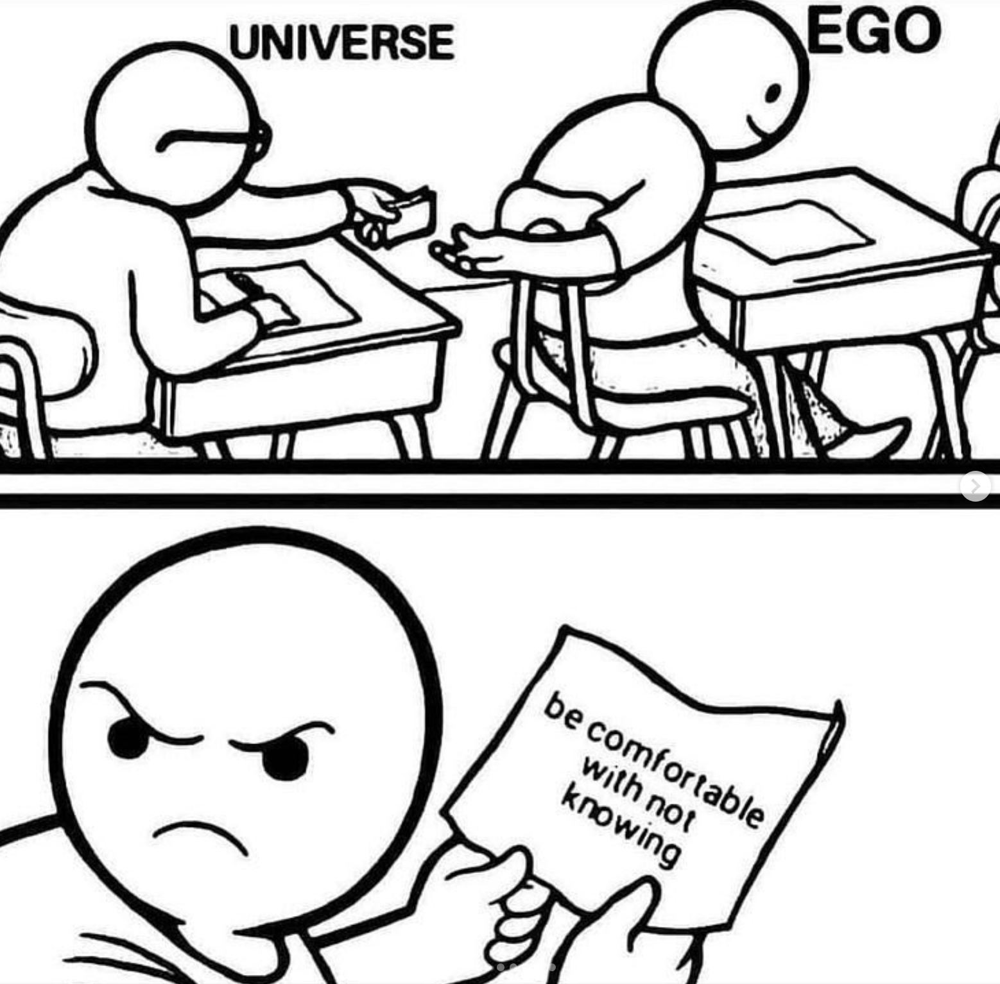

Spend enough time on the productivity corner of the internet and you'll read about Warren Buffett's _5/25 rule_. The idea is about finding focus, forgoing distractions. First, you enumerate twenty-five things on your to-do list (or similarly twenty-five of your goals, aspirations, etc.). Rank them in order of importance, then cross out everything but the top five. The result is two distinct lists, A and B. List A comprises those uncrossed items, and they should become your priorities—focus on them. List B comprises the balance, the crossed-out items. They should not simply be less important, rather they should be *actively avoided*, the argument goes. Since you will easily become distracted by these lower priorities, extra care should be taken to not draw attention away from List A.

Prioritisation has been at the front of my mind this year. At the start of my PhD, I wrote about focus, and the pleasure of narrowing down what one is working on in this life. I asserted, and still believe, that such a decision is curiously liberating. To say no to the many in favour of the one is, in fact, a joy. However, now that I am _in_ this chapter of singular focus, defined at the minimum as the 3-4 years of a doctoral programme, I have realised how many decisions exist within this one focus area. The PhD is not an atomic unit of direction, and comprises a multitude of angles and questions (arguably by design). I have chosen my path, narrowed down my attention, only to find a million more things that interest me within that narrow path—gah, a Russian doll of research! Curiosity seems to be a beast that, as you push inwards, continually pushes outwards.

Though a complex relationship, I must say that I love this beast. Lest we tame our curiosity, I suspect its better to be fascinated by the world despite struggling with problem choice—it is the price to pay. However, practically, I also recognise that jumping between one million things is not conducive—deep focus does help me be productive, and that was the whole point of taking the PhD step. I need to control the beast without breaking its spirit. Of course, we're fighting an uphill battle in this era. I try abstain from TikTok brainrot, with the noble goal of protecting my attention span, only to lean into Claude Code's slot machine of dopamine hits. We are now told that it is possible to pursue many directions in parallel (at the price of a few Mac Minis). The old saying of "you can do anything but not everything" seems to be giving way to "maybe you *can* do everything?" More ideas, quicker, sooner, easier, faster—a glorious utopia for those with curiosity! My side-project-loving self stares excitedly at the prospect of moving fast enough that I can complete many things, covering many domains. Indeed, there's an [argument](https://centuriae.github.io/posts/03.html) for being a generalist in this climate. But sometimes, blurry days spin by, and if I'm not careful, I'm suddenly running ten ideas in parallel; I'm deep into the casino.

With this preamble in my mind, I came into this writing weekend with a circulating disquiet and a goal to solve it. I feel excited by all the directions my mind is being tugged—the world is wonderfully fascinating—but equally feel worried I am diluting my impact. I flip flop between being stoked about all the different things I am trying and learning, and being scared that I'm not spending enough time on a single thing. And yet, before carefully introspecting where these feelings were coming from, truly and deeply, I jumped to a proposed solution: just focus, silly! Listen to Warren Buffett, right? In the [words](https://jamesclear.com/buffett-focus) of self-help guru James Clear, "Given \[Buffett's\] success, it stands to reason that \[he\] has an excellent understanding of how to spend his time each day. From a monetary perspective, you could say that he manages his time better than anyone else." That was it: this antidote to chaos was what I needed to lean into and flesh out in my writing over the weekend. How can I ruthlessly prioritise, and cull everything that doesn't make it? How can I _lock tf in_, as they say. That's what would quell my simmering doctoral anxiety.

Upon actually weighing the idea, though, something was not sitting right, and in my conversations with fellow retreat-goers, it seemed that my headspace was not accurately being reflected. So I went on a search to the source himself—perhaps surrounding context could illuminate more about this "excellent understanding"? I had to filter through pages and pages of people talking about the idea, but no sources of him actually saying it—many links of a chain without a root node. You might protest here, "sure he probably didn't actually say that, but it's still great advice!" And then, aha, I found [this video](https://www.youtube.com/watch?v=KylZCuzPgjc). In it, after an audience member says, "I'm really curious how you came up with this \[advice\] and what other methods you have to prioritising your desires," Buffett replies:

> Well, I’m actually more curious about how _you_ came up with it, because it really isn’t the case. It sounds like a very good method of operating, but it’s much more disciplined than I actually am. If they stick fudge down in front of me, I eat it! I’m not thinking about 25 other choices... But I’ve never made a list. I can't recall making a list in my life. But maybe I'll start; you’ve given me an idea.

It is not that the quote was simply misattributed, instead his perspective seems to be quite orthogonal. He goes on to share that he tries to live a simple life, pursues things he truly enjoys, and gets lots of sleep... That's great and I'm happy for him, but what should I do about my PhD then, Warren?!

I used this comical fudging of events as a hook for my introspection—an entry point to what was going on underneath. It's not *bad* advice; indeed, echoing the man, "it sounds like a very good method of operating!" But my interest piqued around this: why do we believe and distribute these fake quotes so readily? The internet abounds with supposed proclamations from Nelson Mandela, Albert Einstein, and Gandhi about life, death, and all that is between. Perhaps it is that we want to affirm some latent belief within us through an authoritative source? We adopt a belief ("our deepest fear is that we are powerful beyond measure") and we retrofit it to the character that would conceivably espouse it (Nelly M, of course, [right](https://www.nelsonmandela.org/news/entry/deepest-fear-quote-not-mr-mandelas/)?). In this case, take something which seems to be a good blueprint for success; Buffett is wildly successful; so he'd probably say it! Quite the contrary.

Interestingly, though, I suspect with these latent beliefs seeking an endorsement, it is not that they are necessarily true, but that we *want* them to be true. That's why we want the endorsement! We need validation. Through some more digging into my headspace, I found what I wanted validated: by _locking tf in_, following Warren's sage advice, I can quell the *not knowing*. A PhD is hard because you're staring into the abyss—good research is taking a step outside of the current state of knowledge, which is, by definition, unknown. And I think now 147 days into the PhD—versus the more jovial 34th day of my prior writing—I have started clasping for certainty. I am still loving what I do, it's just easy to start implicitly yearning for some pre-planned path. Squash the complexity, give me the recipe, let me proceed, please. And frankly, it would be ideal if I could solve this conundrum via the act of sheer focus—more culling of bad ideas, more ruthless prioritisation, more certainty!

Prioritising is obviously not inherently evil—it's necessary, healthy, and there is actually a great sentiment in the 5/25 rule. But in pursuing such a rigid idea of an academic's journey, I am concerned we lose the essence of the research itself, the reason we're doing what we're doing. Miley Cyrus was right: it's the climb! I want to be more effective in my work, and that's a good thing, but where's that desire coming from? I want to be careful to not use PhDmaxxing to bypass the beauty of standing at the edge of something new, something unknown. I suppose I am writing this piece as a form of comfort to myself: I know that holding the full weight of complexity is scary, and latching onto certainty eases the heart in the short-term. But research is about play! About curiosity. About joy in not knowing. From John Ziman in "The Problem of Problem Choice,"

>But the context of a research plan is intentional rather than justificatory.  Its provenance and its objectives are genuinely uncertain; it can never be made perfectly obvious why it should be undertaken, and its outcome cannot be known in advance.

In a beautiful way, these reflections arose at a meta level, in the act of the writing retreat itself. My temptations were to come into the weekend with my piece perfectly planned and plotted: my problem is focus, here's my thesis of how I'll fix it, and now I'll write down the words. _k thx bye_. Even in my original conception of [Centuriae](https://centuriae.github.io/posts/00.html), I spent a lot of time emphasising that people need the space to _write down_ their ideas, yet I omitted that people also need time to _figure out_ those ideas. What I found on the retreat, joyfully, was my ideas being tested in real-time. This piece evolved in many directions, and feels (present tense) more like a discovery than an assertion. And in that way, it was co-created by all those around me—those who shared insights, bounced ideas, or simply made me a cup of tea. (At the risk of banality, is that not the beauty of writing, or life itself? Love, too, is not something to be prepared for, during months of cerebral forethought and patient waiting, only to be executed perfectly on the day of union. Love _is_ the process.) During Centuriae and a PhD alike (and love too), it would be fantastic to plan the path ahead and make the "work" just trekking along that path. Alas, the path unfolds as it is trodden!

Thanks to Instagram for this one.

So where am I with the simmering anxiety? It's still there! These musings do little to ease the realities of deadlines, timelines, and papers to be written (at times it feels like the 4 year doctoral countdown is persistently ticking). And honestly, this weekend of writing leaves me with many more questions than answers—such a wonderfully engaging two-something days it has been! Endless great discussions with a fantastic, kind group of thinkers. Therefore, true to the spirit of the retreat, I'm releasing these thoughts without a neat conclusion. After all, what is a neat conclusion in this dizzying world? Perhaps I should do the 5/25 thing, but perhaps not. And maybe I should use AI agents more. Or maybe I should not use AI agents at all. To be a specialist, to be a generalist? AGI soon? AGI never? And where does that leave us? Gah. There's so much to think about, to internalise, to weigh up, to decide. 

And then, well, there's the fudge in front of me. 🍫
