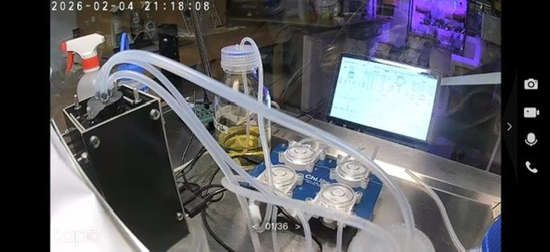

Project updates:

- The electronic lab notebook and inventory system is set up using Airtable. Experimental data, metadata and setup details are all being logged. We are live!
- The first experiment was livestreamed via a £12 baby monitor, with simultaneous data streaming, using cultivawild type E. coli in LB media.

Learnings & developments:

- Airtable is pay-per-row, which makes it prohibitively expensive for timestamped data at scale, I plan on migrating to Open Science Archive with public URL hosting ASAP.
- I will begin using Cultivarium's PRISM system for protocol creation and validation, this will make reduce friction towards making robust, reproducible experiments.
- The next runs will be with defined media and with replicates. My thanks to David Jordan for building me another bioreactor!

---

Having just attended the ARIA Trust Everything Everywhere Demo Day I thought I would write about one specific aspect of the Live Sciences System. Trust.

**Trust is Misplaced in Science**

Academic reputation is a proxy for trust, this should not be the case. All you need to do is look at Elisabeth Bik and Sholto David's work to reveal the grim reality of fraudulent science. Researchers in academia create false data actively as well as unknowningly. There are also trust issues between scientists and the public; the COVID pandemic demonstrated how politics and  a lack of transparency can erode trust in science. With Live Sciences, I want to create infrastructure that eradicates the need for reliance on institutional reputation. 

When I [introduced the project](https://centuriae.github.io/posts/01.html) in November I described three functional layers: Automation, verification and interpretation.

The verification layer includes cryptographically-proofing, filming and live-streaming the data in real time before storing as metadata.

I have since realised this is not enough. In the following section I will describe what is needed to create a biological data stack or biological oracle that enables outputted data to be trusted:

- **Layer 1:** Consumables, reagents, media logged
- **Layer 2:** Hardware & wetware attestation
- **Layer 3:** Computer vision verification of experimental prep
- **Layer 4:** Raw data immutability 
- **Layer 5:** Multi-sensor phenotypic signatures
- **Layer 6:** Consensus

#### Layer 1
**Consumables, reagents, media, strains logged** guarantees all inputs are defined and validated. For consumables, reagents and media, this could be the manufacturer. 

#### Layer 2
**Hardware & wetware attestation** requires device IDs for specific data-producing components and equipment calibration information. For strains, it would be their provenance and genetic information. 

#### Layer 3
**Computer vision verification** for *how* the inputs are added to the system. For this we could use example matta.ai and PRISM, which can spot errors in recorded experiments & capture tacit knowledge. 

#### Layer 4
**Raw data immutability** prevents forging or synthetic results entering the system, data should be streamed directly on chain and online, generating a watermarked and therefore authenticated dataset. 

#### Layer 5
**Multi-sensor phenotypic signatures** leverage the relationship between data points as an unique id to that experiment. For instance, in my own experiments, this could be the relationship between optical density wavelengths, carbon dioxide production and oxygen absorption. 

#### Layer 6
**Consensus** With a network of scientists running replicates and slight variants of experiments we can compare results to validate authenticity and reproducbility. With widescale adoption you could even bayesian algorithm that incorporates bias between experiments and also catches the 'tacit' knoweldge within the experimental setup that leads to unexpected phenotypes and large variance between laboratories.

If there is centralised system issuing experiments, they could include random environmental challenges such as temperature spikes producing a unique proof that the experiment is genuine and was executed correcrtly, eliminating bad actors or incorrect experimental data.

I will be the first to admit that there is no silver bullet to this problem and biological contamination could still pose an issue when using wild type strains not edited for specific auxotrophies or antibiotic resistances. Having enough people in your network of scientists so that you are able to create replicates and gather valuable data is also very important. I will cover incentive mechanisms for adoption in another blog to come :)

PRISM: <https://blog.cultivarium.org/p/prism-capturing-the-invisible-art>

Science Integrity Digest (Elisabeth Bik): <https://scienceintegritydigest.com/about/>

For Better Science (Sholto David): <https://forbetterscience.com/author/sholtodavid/>

Matta: <https://www.matta.ai/>

Open Science Archive: <https://opensciencearchive.org>
