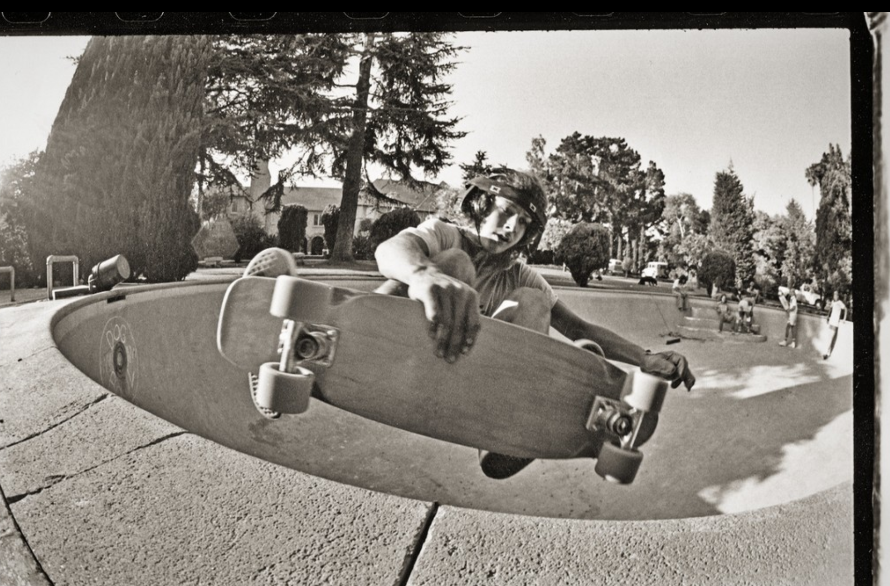
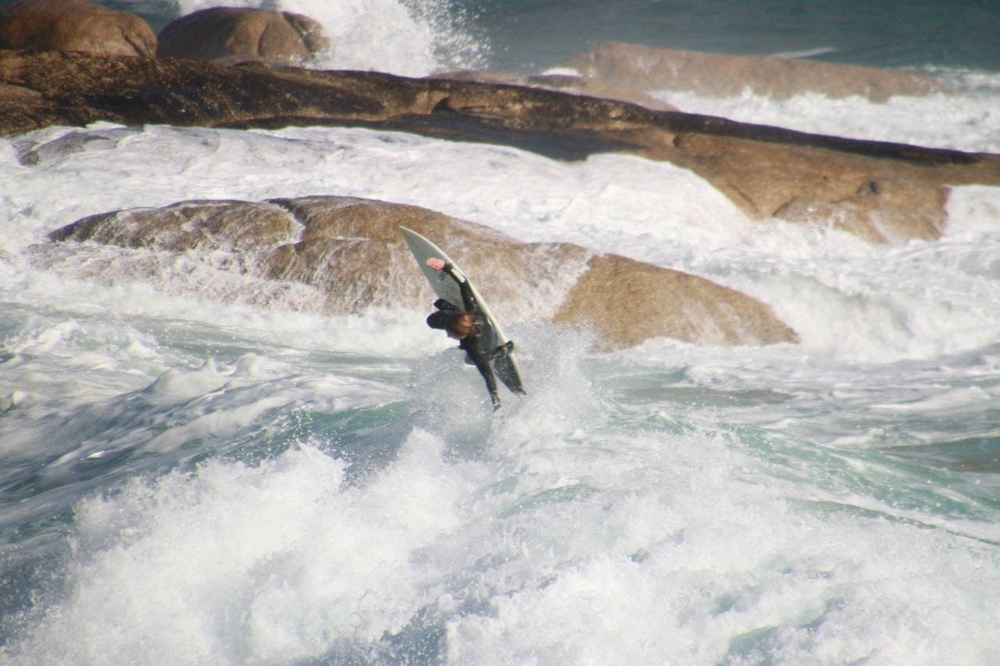
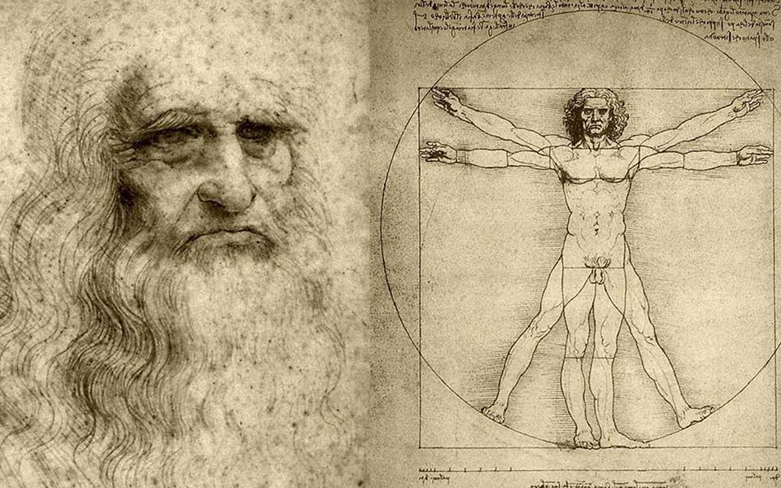

**TL;DR** In the rise of AI, what should we actually learn? Maybe not only deeper specialisation, but broader human intelligence: the ability to learn widely, transfer ideas across domains, adapt to uncertainty and stay fundamentally human.

## What Should We Learn in the Age of AI?

In the rise of AI, we are all being pushed toward a version of the same question. Parents are thinking about their children's education, students are choosing degrees, and workers are wondering whether their skills will still matter as the world shifts under their feet. It forces us to question the education system itself: *what should we actually learn now?* Not just to get a job, but to prepare for an increasingly uncertain future. How do we remain useful, adaptable and human in a world increasingly shaped by AI?

I think we are in a pickle. In history, we have seen technological revolutions, and they have always brought about change. Changes in skills, jobs and what society values. But unlike the rise of the loom or the dot-com boom, we are seeing rapid development and overnight impact. A single update of software and now it hits us all in days. Within a single generation, we are able to flip things. Heck, even in my little life of learning (2021-2025), doing a PhD in machine learning and language modelling, ChatGPT came out and flipped the natural language processing world on its face. So this begs the question: when we learn things, we prepare ourselves for the future world, but we have no clue what that will look like. We know for certain that things will change, and fast. Hence the pickle we are in 🥒.

## What Education Is Actually For

I remember having a discussion between my two older brothers about the purpose of education. Brother A is a successful marine engineer and his school of thought was that education allows be focused to the job. Brother B, who studied philosophy and then law thereafter, posed that education trained the mind and thinking. The subject matter was less important than the capacity to learn and understand the concepts behind it. Playing Switzerland between them, I see merit in both. Education should give you useful subject knowledge, but it should also develop your mind's capabilities.

Now we have the why of education, let's consider the how. You are taught things and then you are evaluated. Higher scores try to infer your competency and *intelligence* in a domain. But being proficient in a single domain does not necessarily mean you are intelligent, as human intelligence is fundamentally broad. Being a wizard at chess and mathematics does not mean you can cast the same spells during public speaking. This matters because the domains we treat as safe keep changing. When I went to university, business, accounting, economics and finance were sold as stable paths. Then big tech boomed, computer science was in vogue, and now even entry-level coding work is being squeezed by coding agents. So what is it about these areas of specialisation that is automatable, and what is not? What is fundamentally human?

## Human Intelligence Is Broader Than IQ

All we know for certain is that the world tomorrow is uncertain. I believe the important skills we should learn should prepare us for this uncertainty. Brother A is right. We need depth in our domain expertise for a job. Brother B is also right. We need breadth of mind and content for adaptive thinking. AI today is being evaluated against traditional IQ benchmarks like analytical or mathematical reasoning and linguistic comprehension. We are seeing incredible advances in the game of Go and AI ([AlphaGo documentary](https://www.youtube.com/watch?v=WXuK6gekU1Y)) being able to write whole books. Human intelligence is more than just computation or language. We are also able to speak, dance, sing, cook a dinner with smell and taste, tell jokes, drive a car, play sports, console our loved ones and create new things.

Humans' ability to learn new things, learn many things and transfer those ideas across domains is truly unique. Some of the breakthroughs we have found have come from forming connections between domains. Renaissance artists studying anatomy advanced both medicine and painting simultaneously. Jazz music emerging from African rhythmic traditions, European harmonic structures and contextualised by American blues. Machine learning diffusion models borrowed ideas from thermodynamics and statistical physics, modelling the gradual movement from noise toward structure. Origami's paper-folding artform ended up influencing spacecraft engineering. Skateboarding and surfing continuously shaped one another. Skaters began riding empty swimming pools to mimic waves, while modern surfing absorbed aerial manoeuvres and rotational movement developed in skate culture. The list goes on.

<figure class="collab-figure" style="max-width: 500px; margin: 20px auto;">
  
  <figcaption style="text-align: center; font-size: 14px; color: gray;"> TONY "Mad Dog" ALVA at the "DogBowl" 1977 Santa Monica, California. This is one of the most well known skateboard photographs ever made. The first time a photograph of a front side air was ever published. </figcaption>
</figure>

<figure class="collab-figure" style="max-width: 500px; margin: 20px auto;">
  
  <figcaption style="text-align: center; font-size: 14px; color: gray;"> Fabio at undisclosed location, 2016 Cape Town, South Africa. Trying to mimic his skate and surf heroes by taking to the air. </figcaption>
</figure>

These are small examples, but I think they point to something bigger. Human intelligence is not just solving problems inside one domain. It is the ability to carry ideas, movement, taste and structure from one world into another.

## The CLEAR Human Intelligences

The core human intelligences, inspired a bit by Howard Gardner's [Theory of Multiple Intelligences](https://en.wikipedia.org/wiki/Theory_of_multiple_intelligences), should be made a little more **CLEAR**: **C**reative, **L**inguistic, **E**mbodied, **A**nalytical and **R**elational. This is not a perfect scientific taxonomy, but a personal lens. These are not boxes people fit neatly inside, but different dimensions of human capability. Most people are some strange but beautiful melange.

1. **Creative intelligence** is the ability to imagine, invent and combine things in novel ways. This is seen in visual art, music, rhythm, dramatic performance, comedy and aesthetic taste. Artists, musicians, designers, filmmakers, performers and comedians tend to thrive in this space.
2. **Linguistic intelligence** is the ability to communicate clearly through reading, writing and speaking. It is storytelling, persuasion, explanation, charisma and the structuring of meaning through language. Writers, teachers, lawyers, politicians and managers often rely heavily on this.
3. **Embodied intelligence** is the mind-body connection. Have you ever met someone who can pick up a new sport strangely fast? They mimic movement well, understand timing instinctively and coordinate themselves without overthinking. Dancers, athletes, surgeons, craftspeople and physical instructors move in this world.
4. **Analytical intelligence** is logical and mathematical reasoning. Pattern recognition, puzzle solving and structured problem decomposition. This is the domain most associated with engineers, scientists, programmers and mathematicians.
5. **Relational intelligence** is the ability to understand people, navigate emotions and build trust. Both interpersonal and intrapersonal. Empathy, leadership, emotional regulation, conflict resolution and social awareness. Therapists, teachers, leaders, nurses and great artists often have strong relational intelligence.

Our education systems currently seem to focus on analytical and linguistic intelligence. I think this is because they are easier to standardise and evaluate. But if the future is uncertain, then perhaps the most important skills we can learn are the ones that grow the full range of our human intelligences. The ones that allow us to generalise, adapt and stay human as the world changes.

## What AI Still Cannot Replace

Throughout history, we have tried to automate the things society values most. But perhaps part of what made those things valuable was the human-ness itself. In the AI world, we value speed, but no code has made a whole audience cry. We are seeing more automation in analytical and linguistic tasks, the **A** and **L** intelligences. But that leaves space for the others to shine.

Take coffee, for example. We could make it faster, cheaper and more automated. And yet, big cities are full of speciality coffee shops with fancy baristas, strange little interiors, good smells, eclectic music, friendly staff and visual art rosettas on top. The coffee is only part of the value. The rest is taste, care, atmosphere, craft and human presence.

<figure class="collab-figure" style="max-width: 500px; margin: 20px auto;">
  
  <figcaption style="text-align: center; font-size: 14px; color: gray;"> Latte art. Human craft at its finest haha. </figcaption>
</figure>

AI can write, reason and generate code. But it still struggles with the deeply human forms of intelligence: taste, embodiment, emotional presence, physical mastery and trust. As some forms of cognitive labour become abundant, the things that feel human may become more valuable.

## The Return of the Renaissance Generalist

In an uncertain world, breadth of knowledge will increase our adaptability. Perhaps the most valuable person will no longer be the narrow specialist, but the person who can move between domains, learn quickly and transfer ideas across contexts. Not because depth is unimportant, but because wide knowledge increases the number of possible new connections.

This is why I suspect we may see a return of the *Renaissance human*, or at least a modern version of studying "*The Classics*". Not because Latin, art or pure mathematics always have direct application, but because they sharpen your underlying intelligences: language, creativity and logical abstraction. The Greeks had this ideal too. The great philosophers could also be mathematicians, politicians and participants in the Olympic Games.

I am not saying we should all become polymaths. But I think there is value in being comfortable across multiple intelligences. Someone analytical but also creative. Technical but physically in tune. Linguistically sharp but relationally warm, to themselves and others. As analytical and linguistic tasks become increasingly automated, the uniquely human advantage may come from combining intelligences rather than maximising only one. The future may belong less to the perfectly optimised specialist and more to the curious generalist who can build bridges between worlds.

<figure class="collab-figure" style="max-width: 500px; margin: 20px auto;">
  
  <figcaption style="text-align: center; font-size: 14px; color: gray;"> Leonardo da Vinci's Vitruvian Man, a symbol of the old ideal that art, science, mathematics and the body were not separate worlds.</figcaption>
</figure>

## Education for an Uncertain Future

So, *what should we actually learn*? I do not think the honest answer is one subject, degree or career path. The world is changing too quickly for that. If education is meant to prepare us for the future, then perhaps it should prepare us for uncertainty itself.

In my own path, I studied business, then moved toward statistics because it gave me depth that could be applied across many problems. At the time, I was fascinated by deep learning and medical applications. That eventually led to a PhD in machine learning for language, legal reasoning and music generation. It was not tidy, but perhaps that was the point. The strange mix may be the useful part.

We should still pursue depth and expertise, but also grow the full range of our human intelligences: creative, linguistic, embodied, analytical and relational. A modern version of the classics might mean mathematics and programming, but also writing, art, psychology, biology, sport, music, public speaking and craft. Not to master everything, but to become more comfortable across different ways of thinking and being.

For children growing up entirely in the age of AI, this matters even more. We cannot know which industries will survive unchanged, or which skills will suddenly become automated or redefined. But we can help them become adaptable, curious and deeply human.

Maybe I am too optimistic but in the rise of automation I look forward to the backlash rise of humanation.
