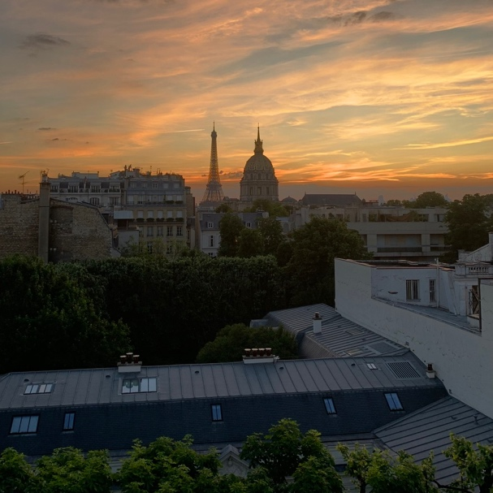
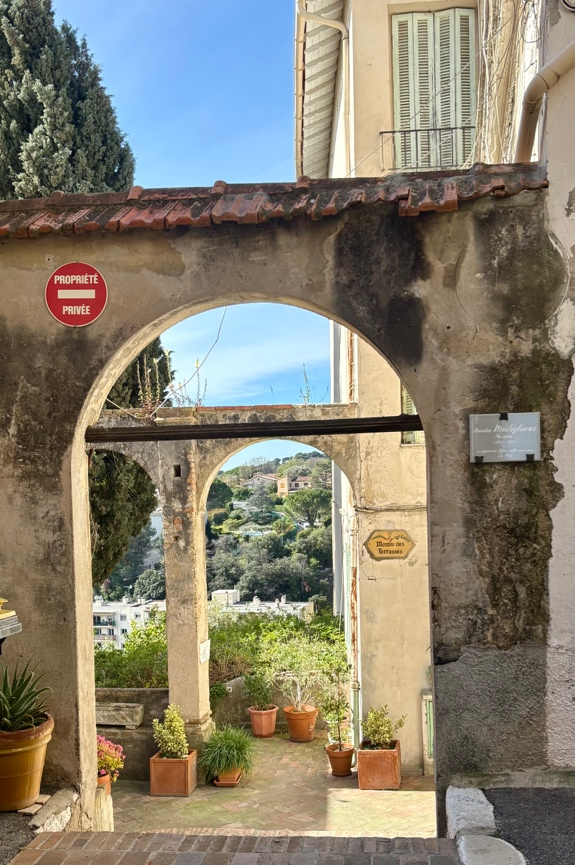
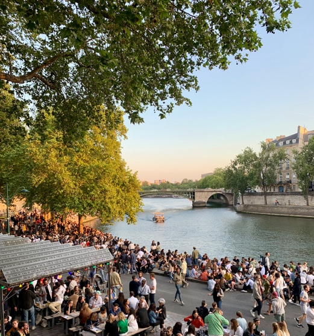

I decided to begin this [series](https://peregrine100.substack.com/) a few months ago when I moved from Brussels to London, ending a 4.5-year streak of somehow navigating healthcare in French. I expected this move to bring far more ease in communication and, whilst this is the case in many aspects of my new life, some social dimensions are now more challenging or stilted than before.

Until a few years ago, despite growing up in a country with 12 official languages, I was a not-so-proud member of the great anglophone monolingual tradition. I then moved to France equipped with three months of Duolingo and a dream (delusion), implicitly assuming it couldn't be *that* hard to get by – the *Entente Cordiale* was more than a century old, after all. Even in the soft play area of an international master's programme, I came face to face with the realities of the language barrier: from lecturers I could barely understand (and vice versa[^1]), to a doctor who misunderstood my Lexamil prescription and put me on a heavy mood tranquiliser for three months (wouldn't recommend).

What's far more interesting is the positive side of operating in a second language or, at least, being in social groups where some or all are not completely fluent in the *lingua franca*.[^2] The accepted view is that this makes people more open, better able to judge situations objectively, and more empathetic – which all seems sensible. Many multilingual friends also speak about different personalities emerging in different languages. I recognise this in myself too, though the outcome is highly context dependent. A few examples follow, each identified by Ethel Cain songs.[^3]

1\. *Strangers*

A reliable barber *ne court pas les rues* (literally: doesn't run in the streets, i.e. rare as hen's teeth) and, for that reason, I'm very thankful for Franck – my former barber on Rue Vaneau – a sweet 50-year-old from Normandie who would regale me with stories ranging from his estrangement from his family to questionable Christmas Eve parties at Paris' underground gay clubs. He slowed down his French for my benefit, allowing me to understand ~70% of what he was saying, and listened kindly to my tales and life updates. That said, he did tend to conflate *l'Afrique du Sud* and *l'Australie*, often asking whether I liked koala bears.

By contrast, I have never willingly exchanged more than five sentences with an English-speaking barber and I don't plan to, preferring to close my eyes, grit my teeth and accept whatever fate awaits me in the mirror once their work is done. Yet in Franck's salon and similar everyday contexts, the thrill of a very simple human connection in a foreign language would win out, and I'd find myself chattier and more open than usual. Further, the three-second lag spent processing what the person said whilst nodding agreeably consistently established open-heartedness and acceptance at the core of each interaction.

<figure class="collab-figure" style="max-width: 500px; margin: 20px auto;">
  
  <figcaption style="text-align: center; font-size: 14px; color: gray;">May '24, Rue Vaneau, Paris 7e. To clarify: not the view from Franck's salon.</figcaption>
</figure>

2\. *Family Tree*

My grandmother lived in France for a time, and I remain in good contact with an old friend of hers, Marie-Thérèse, who lives in Cagnes-sur-Mer. We see each other once a year and she has become, in essence, my French grandmother. She takes me out for lunch in the Côte d'Azur sun where we exchange gossip and updates on her Provençal garden over pad thai and mochis at [Chez Mat't](https://maps.app.goo.gl/AVWXAEgNrH3JEJYRA), whose owner is an old friend of hers. An 80-year-old woman with twice my energy, she speaks exclusively in French, only switching briefly when I get stuck. Whilst this means I have a somewhat murky understanding of the lives of her kids and grandkids and often struggle to fully express myself; it has created a distinct and light-hearted intergenerational friendship in which I step outside of myself and feel more carefree and jovial than I would expect in that sort of environment.

<figure class="collab-figure" style="max-width: 500px; margin: 20px auto;">
  
  <figcaption style="text-align: center; font-size: 14px; color: gray;">April '26, Cagnes-sur-Mer. Just a pretty view.</figcaption>
</figure>

3\. *Crush*

Motivation to learn a new language is very cyclical, and I owe the majority of my acquired French to a few months around winter '23/24 when I had a crush on a French girl – very charming, had the accent, brown eyes – classic case. Her French came out in a blur, so we'd converse in English littered with French [code-switching](https://www.cam.ac.uk/research/news/opinion-speaking-in-tongues-the-many-benefits-of-bilingualism). However, the asynchronous nature of texting created room for more French, allowing her to express herself more fully and giving me a chance to try and impress. More broadly, texting with some linguistic friction created a space more amenable to subtlety and flirting. Prior to this, I'd never been a smooth man when texting in plain English, but the cognitive separation in this case allowed me to toy with this more lightly and has now granted me a serviceable level of charm over text (I think/hope).

<figure class="collab-figure" style="max-width: 500px; margin: 20px auto;">
  
  <figcaption style="text-align: center; font-size: 14px; color: gray;">Jan '24, Saint-Cergue, 1 hr from Geneva. Not much happens in Geneva in winter but it's very good for snowy hikes, cramming vocab, fondue and overthinking texts.</figcaption>
</figure>

4\. *Golden Age*

Finally, and most tangibly, I noticed that with select close friends, we formed our own unique dialect, complete with speech patterns and intonations that are exclusive to these relationships. My best friend from my master's is a Costa Rican who attests that when we first met, he understood 60% of my English (at best). Fortunately, he was happy to spend time together and become friends as it "seemed like [I] gave good vibes". Over time, I smoothed and adapted my speech, whilst his now stellar English was forged in the crucible of my accent and weirdly chosen phrases.

Any good friendship is packed with inside jokes and unique subtleties of communication. However, my closest friendships from this time developed an exploratory linguistic dimension where, in addition to getting to know someone from a completely different world, both people were forming a way of speaking that could reflect the new connection. Naturally, the demanding nature of this forced me to be more selective with my social energy than I was previously. However, it resulted in incredibly novel, fun, and intimate friendships encased in these carefully curated, shared worlds that I've rarely experienced in friendships with fellow native English speakers.

<figure class="collab-figure" style="max-width: 500px; margin: 20px auto;">
  
  <figcaption style="text-align: center; font-size: 14px; color: gray;">June '23, le quai des Célestins, Paris 4e. Unimpeachable spot for a yap in the sun.</figcaption>
</figure>

Finding a simplified common ground for communication has its costs, obviously. Conversations can be quite awkward; I lose a lot of my dry and obscure humour and struggle to express more complex thoughts. In addition, I end up having fewer intellectual conversations.[^4] However, the process of overcoming these challenges shuts out many social anxieties and imbues a simplicity and sincerity into social situations that ultimately leads to far deeper and more novel connections. For this reason, *franglais*, typically used to denote French peppered with English but can also refer to any sort of hybridisation, is the language in which I feel my best and most joyous self.

Cimer, top.

*Song: Aicha – Khaled*

+++++++++++++++++

For the forthcoming polished version of this and whatever else is to come, please subscribe here: [peregrine100.substack.com](https://peregrine100.substack.com/profile)

[^1]: The silver lining was that I soon figured out that any presentation spoken quickly and confidently often yielded high marks from professors hesitant to admit they couldn't follow what I was saying.

[^2]: Whilst London is super international and makes for meeting fascinating people, everyone's English is good and hence this dynamic doesn't really arise.

[^3]: Beyond the titles, these are entirely unrelated to the content. Ethel Cain just rocks.

[^4]: This is entirely conditional on my mediocre French level. I think most of the above would dissipate if I were entirely fluent, apart from some shifts in personality between languages.
